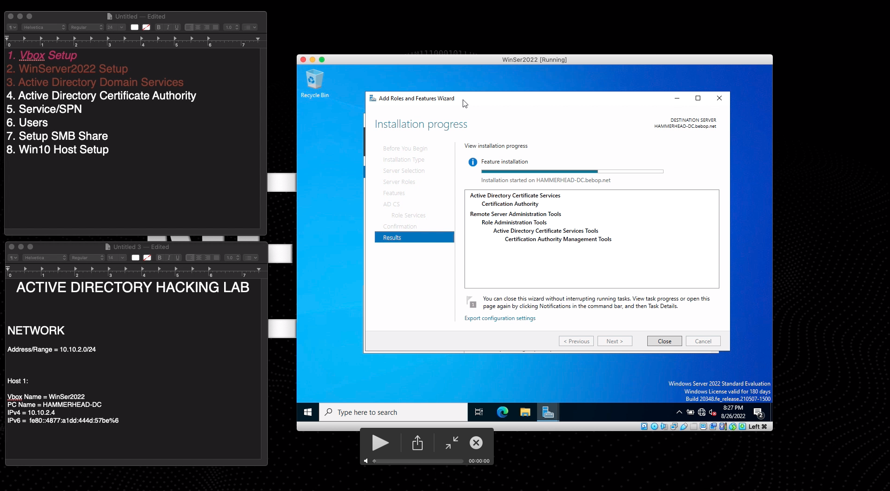
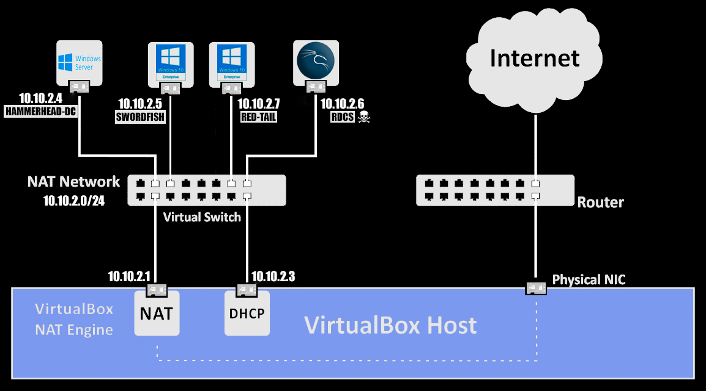

# ACTIVE DIRECTORY HACKING LAB

 I created this lab to research exploits and find vulnerabilities within 
Microsoft Windows and Active Directory. The environment was created in 
VirtualBox using Kali Linux, Microsoft Windows Server 2022, and Windows 10 
Enterprise. You can grab virtualbox and each OS with the following links:

[Virtualbox](https://www.virtualbox.org)

[Windows Server 2022](https://www.microsoft.com/en-us/evalcenter/evaluate-windows-server-2022)  

[Windows 10 Enterprise](https://www.microsoft.com/en-us/evalcenter/evaluate-windows-10-enterprise) 

[Kali Linux](https://www.kali.org) 

 If you would like to set up your own lab or see how I configured mine, check
out the following tutorial:
 
[LAB SETUP](https://youtu.be/6xRZKXiHfS4)

## NETWORK

AD Domain Name = bebop.net \
Address Range = 10.10.2.0/24 \
Domain Controller = 10.10.2.4 \
DHCP Server  = 10.10.2.3 \
Default Gateway = 10.10.2.1 \
DNS Servers = 10.10.2.4 \
SMB = [ON]

## COMPUTERS

### Host 1 (Domain Controller):

Vbox Name = WinSer2022 \
PC Name = HAMMERHEAD-DC \
OS = Windows Server 2022 \
IPv4 = 10.10.2.4 \
IPv6 =  fe80::4877:a1dd:444d:57be%6 

### Host 2:

Vbox Name = Win10.1 \
PC Name = SWORDFISH \
OS = Windows 10 Enterprise \
IPv4 = 10.10.2.5 \
IPv6 = fe80::9db8:3b91:b7ac:a9f9%4 \
Local Account = local_user \
Local Pass = password2 

### Host 3:

Vbox Name = Win10.2 \
PC Name = RED-TAIL \
OS = Windows 10 Enterprise \
IPv4 = 10.10.2.7 \
IPv6 = fe80::9f8:a2fa:66a7:ae53%6 \
Local Account = local_user \
Local Pass = password3 \

### Attack Machine:
 
Vbox Name = Kali \
PC Name = RDCS \
OS = Kali Linux 2022.2 \
IPv4 = 10.10.2.6 \
IPv6 = fe80::a00:27ff:fe76:7444 \
User = vicious \
Password = toor

## USERS

| Username       | Password  | Domain Admin | Function | Primary Computer |
|----------------|-----------|--------------|----------|------------------|
| Administrator  | password1 |     yes      | Admin    | HAMMERHEAD-DC    |
| spike          | password2 |     yes      | User     | SWORDFISH        |
| faye           | password3 |     yes      | User     | RED-TAIL         |
| cbsvc          | password4 |     no       | Service  | n/a              |
| vicious        | toor      |     n/a      | Attacker | RDCS             |

## ATTACKS

### LLMNR, NBNS, and mDNS Poisoning

#### Command Line Tools Needed:
- Responder (Pre-Installed in Kali Linux 2022.2)
- Python3 (Pre-Installed in Kali Linux 2022.2)
- John The Ripper (Pre-Installed in Kali Linux 2022.2)

 LLMNR/NBNS/mDNS poisoning are part of the Adversary-In-The-Middle attack 
family. LLMNR (Link-Local Multicast Name Resolution), NBNS (NetBIOS Name 
Service) and mDNS (Multicast Domain Name System) are all components of 
Microsoft Windows that act as an alternative method for host identification. 
LLMNR (tcp/udp: 5355) allows hosts on the same subnet to query other hosts for
name resolution. NBNS (aka NBT-NS or netbios-ns) (tcp/udp: 137) which is the 
predecessor to LLMNR uses the NetBIOS name of the host to identify the system 
on the same subnet. Lastly, mDNS functions similar to both of its formerly 
mentioned counterparts but was originally a protocol created and used by Apple.
In Windows 10, mDNS was added to the Windows environment due its ease of use.

 All 3 of these protocols are subject to spoofing and can lead to the victim 
machine to send traffic to the attacker that was intended for a different 
destination. Within a windows environment that uses NTLMv2 as an 
authentication method, the victim will send their password hash to the 
machine it believes it needs to authenticate with. If this machine is a hacker
that has accessed your network, then the victim has sent their credentials 
without even having to enter their password.   

 When monitoring the traffic via wireshark, we can see that all 3 protocols are
functioning by default in bebop.net. This is because each protocol is sending
out broadcast/multicast out to every host in the subnet (in this case the 
entire network), and our attacker will be able to see this and capture traffic
using our tool Responder. Responder is a tool within Kali Linux. When these 
LLMNR, NBT-NS, or mDNS queries go out to the network, we will be able to send 
back poisoned responses to the victim. Once we have successfully spoofed the 
victims, it will send back the NTLMv2 hash. We can relay the attack in order 
to access different areas of the network but in this example we will use John 
The Ripper to crack the hash and see if we can get a password. 

 Mitigation for this attack is pretty straight forward for LLMNR and NBT-NS.
Just make sure to turn off both protocols along with NTLM within your domain. 
Kerberos is the more secure solution for authetication and recommended in an 
enterprise enviroment such as this.

Check out my walkthrough for LLMNR, NBT-NS, and mDNS poisoning below:

[LLMNR/NBT-NS/mDNS Poisoning](https://youtu.be/gi-Sj7o1gZw)

### IPv6 Takeover
 

#### Command Line Tools Needed:
- MITM6  • 
- Impacket-NTLMRelayx (Pre-Installed in Kali Linux 2022.2)
- Python3 (Pre-Installed in Kali Linux 2022.2)

 IPv6 Takeover attacks might just be my favorite so far. The reason I find this
attack so useful is because unlike many other attacks I have attempted in my 
past, this attack takes advantage of an area easily overlooked and can be done
using default Windows configurations. 

 Despite its ongoing adoption, IPv6 is often not used in many environments. 
Yet, despite its lack of use, it’s often enabled and Windows systems 
(since Windows Vista) will choose IPv6 over IPv4. Another part of this attack 
will focus on exploiting WPAD (Windows Proxy Auto Discovery). 

 Using mitm6, we will be able to set the victim's DNS server to the attacker's 
IPv6 address. From there will abuse the WPAD to allow the takeover to occur. 

 Mitigation for this attack can be done by using Kerberos instead of NTLM for
authentication. Other options included turning off IPv6, and WPAD but 
moving to Kerberos would be the cleanest and most secure method in my opinion.

To get a better understanding of how this attack works under the
hood check out this article [mitm6](https://blog.fox-it.com/2018/01/11/mitm6-compromising-ipv4-networks-via-ipv6), 
and to watch my walktrhough of the attack check out the video below:

[IPv6 Takeover](https://youtu.be/Ee6BzduJErs)

### Kerberoasting

*coming soon*

### PetitPotam

*coming soonish*

### SMBRelay

*coming soonish, but not as soonish as the last one*

